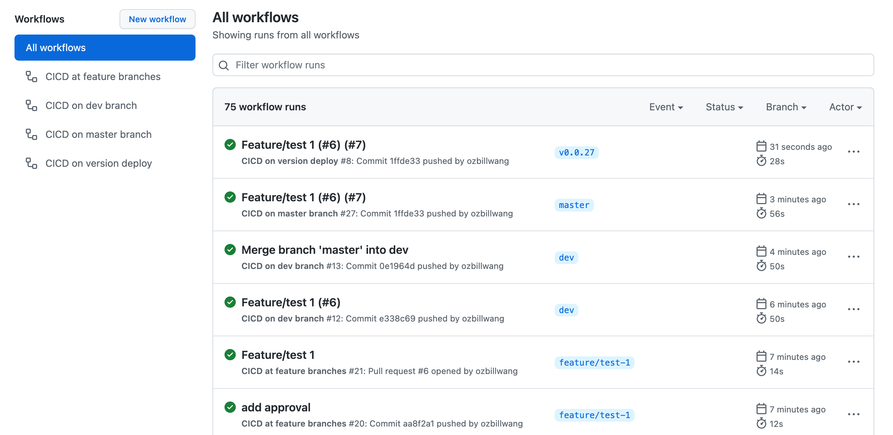
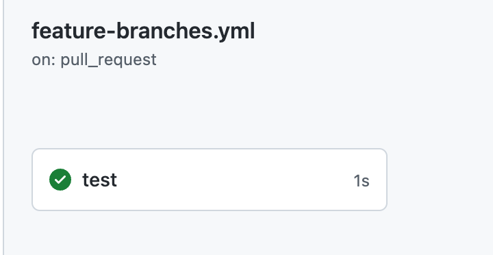
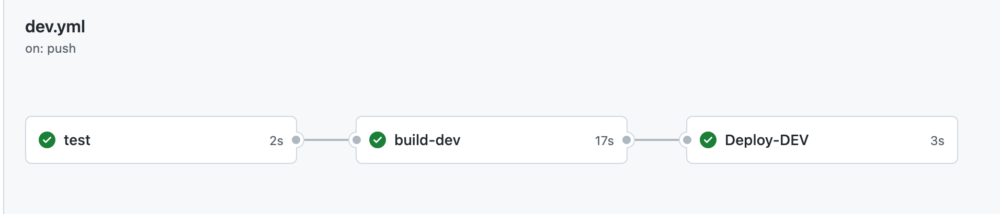
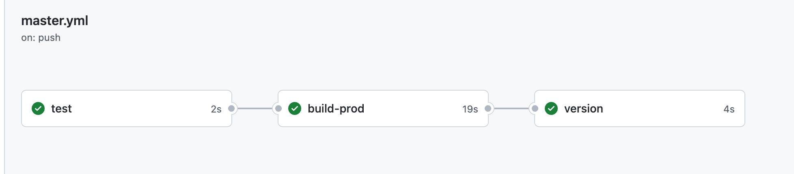
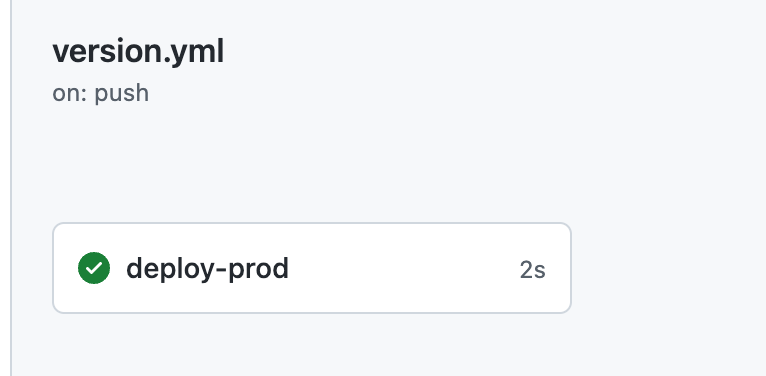

# github-action-pipeline
Sample to manage the releaess with Github Action

# Pipelines with several stages

Suppose we have two main branches, `dev` and `master`

| Stage   |      Description      |  Branches | Notes |
|----------|:-------------|:-------------:|:-------------|
| Test  | two conditions: (1) new commit is pushed to feature branches (not dev or master branches) (2) pull request to dev or master branches| feature branches, not dev or master branches | Test can be unit tests, integration test, lint, etc |
| Dev |    trigger the build and deployment to dev environment when new commit is pushed to Dev  |  dev  | you can set more main branches if needed, such as staging, svt, qa, etc |
| Prod |    trigger the build when new push to master, generate a new semantic versioning tag and push it to the commit |  master  | main or master branch |
| Production deploy on new tag |    trigger the production deployment when new tag is pushed to master branch , wait for approval. If approved, will deploy to production|  master  |  |
| rollback | re-run the jobs on pervious tag/release |  master  |  |

# CICD pipeline diagrams

With Github Action, I can manage the cicd pipeline with best practices. 

Explanation:

* two conditions (1) commits to non-main branches, such as feature branches, bugfix branches, in this sample, not dev or master branches. (2) Pull requests to main branches

Will only run the tests, such as unit test, integration test, and security check, etc.

* commit or pull request merged to dev branch

Will run tests, build and dev deployment

* commit or pull request merged to master branch

Will run test, build, generate and push incremental semantic version tag automatically, for example, if the latest tag on master branch is `1.0.123`, after build is successful, pipeline will create new tag `1.0.124` on master branch

* if new version detected (new tag applied on master branch)

Will wait for approval (set the environment `produciton`) , after approved, deploy to production environment. 

You can add other environments, such as staging, qa, for your project, if required.
